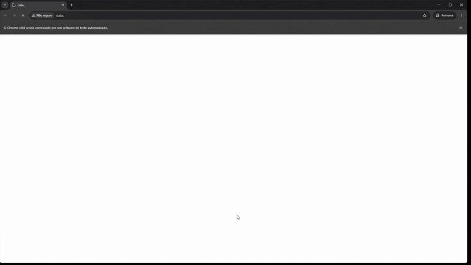

# RPA – Ajuste Automático de Ponto

## 📌 Descrição do Projeto

Este projeto consiste em um **RPA (Robotic Process Automation)** desenvolvido em Python para **bater e/ou ajustar automaticamente o ponto eletrônico**.

O robô foi projetado para operar de forma **totalmente automática**, podendo ser executado manualmente ou de forma agendada via **Agendador de Tarefas do Windows**, garantindo que o ponto seja registrado diariamente sem intervenção do usuário.

---

## 🎥 Demonstração

<p align="center">
  
</p>

## ⚙️ Funcionamento

### Comportamento Padrão

Quando nenhum parâmetro adicional é informado:

- O robô **baterá o ponto automaticamente no dia atual**
- A execução ocorre **somente em dias úteis (segunda a sexta-feira)**
- Os horários padrão utilizados são:
  - **09:00**
  - **12:00**
  - **13:00**
  - **18:00**

---

### Comportamento com Lista Personalizada

O robô também permite receber uma **lista personalizada de dias e horários**, possibilitando:

- Ajustar pontos de **dias específicos**
- Definir **horários personalizados** (Todos os dias serão atualizados com os horários informados)

Quando essa lista é fornecida, o comportamento padrão é ignorado, e o robô executa exatamente conforme os dados informados.

---

## 📂 Estrutura do Projeto

```
.
├── src/
│   ├── main.py
│   ├── logs
│   ├── pacotes
│     ├── __init__.py
│     ├── ajustar_ponto.py
│     ├── validar_cpf.py
│     ├── logger.py
│
├── script.bat
├── requirements.txt
├── README.md
├── .gitignore
```

### Descrição dos Arquivos

- **`src/`**  
  Contém todo o código-fonte Python responsável pela automação do ajuste de ponto.

- **`src/main.py`**  
  Arquivo principal do projeto, responsável por executar o processamento.

- **`src/pacotes/ajustar_ponto.py`**  
  Arquivo responsável por realizar toda a automação com Selenium, como acessar o site, realizar login e os ajustes no ponto.

- **`src/pacotes/validar_cpf.py`**  
  Arquivo responsável por formatar o cpf e verificar se a quantidade de digitos está correta.

- **`src/pacotes/logger.py`**  
  Arquivo responsável por inicializar e formatar o logger do projeto.

- **`src/logs`**  
  Pasta onde os logs da automação ficarão salvos.

- **`script.bat`**  
  Script responsável por:
  - Ativar o ambiente virtual (`venv`)
  - Executar o processo de automação  

  Este arquivo deve ser utilizado pelo **Agendador de Tarefas do Windows** para execução automática.

- **`requirements.txt`**  
  Lista todas as dependências Python necessárias para a execução do projeto.

---

## 🧰 Pré-requisitos

Antes de iniciar, certifique-se de que possui:

- Sistema operacional **Windows**
- **Python 3.9 ou superior** instalado
- Acesso ao sistema de ponto utilizado pelo robô (Solides)
- Permissão para criar tarefas no **Agendador de Tarefas do Windows** (Opcional para orchestração)

---

## 🧪 Configuração do Ambiente Virtual (venv)

O projeto **exige** a utilização de um ambiente virtual (`venv`) localizado **na mesma pasta do `script.bat`**.

### 1️⃣ Criar o ambiente virtual

Na raiz do projeto, execute:

```bash
python -m venv venv
```

---

### 2️⃣ Ativar o ambiente virtual

```bash
venv\Scripts\activate
```

---

### 3️⃣ Instalar as dependências

Com o `venv` ativo, execute:

```bash
pip install -r requirements.txt
```

---

## ▶️ Execução do Projeto

### Execução Manual

Após a configuração do ambiente virtual, execute:

```bash
script.bat
```

O script irá automaticamente:

1. Ativar o `venv`
2. Executar o processo de automação
3. Realizar o ajuste de ponto conforme a configuração padrão ou parâmetros informados

---

## ⏰ Execução Automática (Agendador de Tarefas)

Para que o robô rode automaticamente todos os dias:

1. Abra o **Agendador de Tarefas do Windows**
2. Crie uma **nova tarefa**
3. Configure:
   - **Disparo**: diário
   - **Ação**: executar o arquivo `script.bat`
   - **Diretório inicial**: pasta raiz do projeto
4. Salve a tarefa

⚠️ **Importante:**  
O `script.bat` já está preparado para ativar o ambiente virtual antes de executar o robô, desde que o `venv` esteja corretamente configurado.

---

## 📅 Regras de Execução

- Sem lista personalizada:
  - Executa apenas no **dia atual**
  - Apenas em **dias úteis** 
  - Verifica os feriados para o estado de SP, para alterar basta acessar o arquivo "ajustar_ponto.py" e alterar na linha "feriados = holidays.Brazil(state="SP")"
  - Utiliza os horários padrão: `09:00`, `12:00`, `13:00`, `18:00`

- Com lista personalizada:
  - Executa conforme os dias e horários informados
  - Os horários padrão são ignorados

---

## ⚠️ Observações Importantes

- Recomenda-se executar o robô manualmente ao menos uma vez antes de agendá-lo
- O computador deve estar ligado no horário programado
- Evite executar múltiplas instâncias do robô simultaneamente

---

## 📄 Licença

Este projeto está licenciado sob a licença MIT.